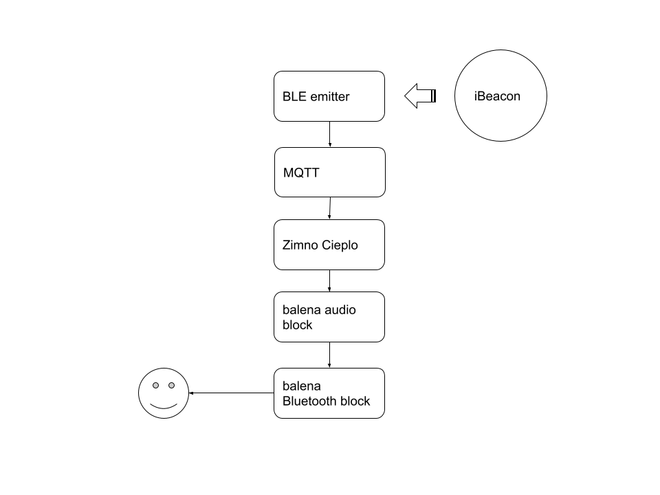

# balena Zimno Cieplo

## Summary

balena Zimno Cieplo runs on a hand-held device powered by balena stack. It navigates a user to his lost objects. This particular implementation uses a Bluetooth Low Energy (BLE) transceiver to quantify iBeacons signals. This project’s name comes from the simple game my daughters play. One searches for an object, another navigates with “zimno”, which mean cold in Polish, when the searcher is getting away from the object. The navigator says “cieplo” (warm) when the searchers is approaching to the object.

## Supported devices

Crrently this appliction has been tested only with Raspberry Pi Zero 2 W.

## Hardware components

- Raspberry Pi Zero 2 W
- Micro SD card
- micro-USB power bank
- Bluetooth headset
- iBeacon (can be simulated by with Beacon Simulater Android application on an Android smart phone)

The price of a Bluetooth can vary significantly if you do not yet have one. With micro SD card ($8), power bank ($10). RPi Zero ($15) and iBeacon tag (> $3), the whole system can be constructed around $40.

## System overview

## `zimnocieplo` service

## `BLE Emitter` service

## `audio` and `bluetooth` services

These services are building blocks provided by the balena team:

- [audio block](https://github.com/balenablocks/audio)
- [bluetooth block](https://github.com/balenablocks/bluetooth)

## Limitations

Locationing with Bluetooth RSSI has a known issues of large fluctuations of measurements which leads to low accurary of distance measurements. This project is a no exception in the sense that the system goes back and forth between detecting and non-detecting states even at close distances of 0.5m to 1.5m. Another facet is that a user need to ssh into the bluetooth device and pair the headset, thouch which should be done only once.