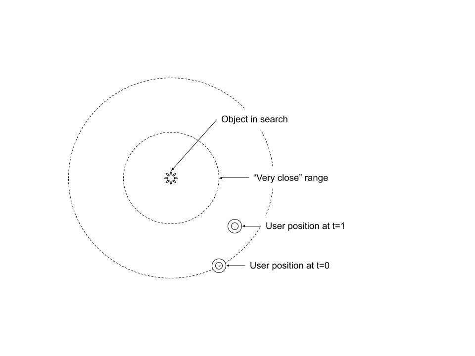
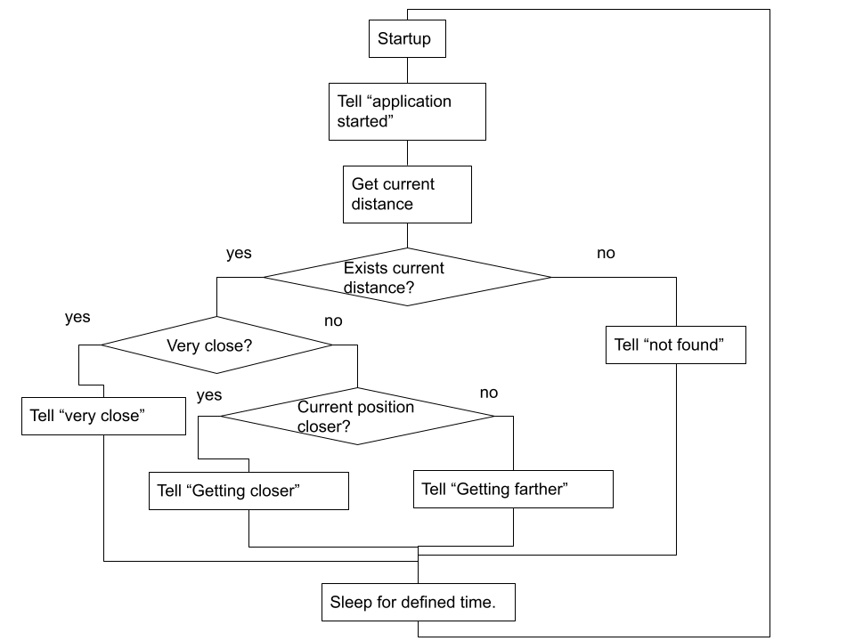

# balena Zimno Cieplo

## Summary

balena Zimno Cieplo runs on a hand-held device powered by balena stack. It navigates a user to his lost objects. This particular implementation uses a Bluetooth Low Energy (BLE) transceiver to quantify iBeacons signals. This project’s name comes from the simple game my daughters play. One searches for an object, another navigates with “zimno”, which mean cold in Polish, when the searcher is getting away from the object. The navigator says “cieplo” (warm) when the searchers is approaching to the object.


## Supported devices

Crrently this appliction has been tested only with Raspberry Pi Zero 2 W.


## Hardware components

- Raspberry Pi Zero 2 W
- Micro SD card
- micro-USB power bank
- Bluetooth headset
- iBeacon (can be simulated by with Beacon Simulater Android application on an Android smart phone)

The price of a Bluetooth can vary significantly if you do not yet have one. With micro SD card ($8), power bank ($10). RPi Zero ($15) and iBeacon tag (> $3), the whole system can be constructed around $40.


## System overview

Overview of the system is to be seen on the diagram below. One thing to note is that `BLE emitter` service can be replaced by any type of emitter, which emits current distance to, say, UWB, wifi, RFID etc.


## `zimnocieplo` service

`zimnocieplo` service receives JSON string encoded`Distance`

```
export interface Distance {
    type: DistanceType;
    previous: number | null;
    current: number | null;
}

type DistanceType = 'BLE';
```

compares the current distance with the previious to give user an appropriate navigation. Interval between navigation steps is decided timing of message arrival, which is determined by the emitter service.





## `BLE Emitter` service

`BLE` service uses `Bluez` facility to scan nearby bluetooth devices periodically and outputs results to a file internally. Then the file contents are streamed to a JavaScript program running in the service to be further processed to be sent to the MQTT server with a defined interval.


## `audio`, `bluetooth` and `mqtt` services

These services are building blocks provided by the balena team:

- [audio block](https://github.com/balenablocks/audio)
- [bluetooth block](https://github.com/balenablocks/bluetooth)

MQTT service is a bare Eclipse MQTT server. You can find the [Docker image on Dockerhub](https://hub.docker.com/_/eclipse-mosquitto/).


## To run Zimno Cieplo

For `ble_emitter` service, set `BEACON_UUID` to your iBeacon tag's UUID, for `bluetooth` service, set `BLUETOOTH_CONNECT_DEVICE` to your Bluetooth headset's MAC address.

## Limitations

Locationing with Bluetooth RSSI has a known issues of large fluctuations of measurements which leads to low accurary of distance measurements. This project is a no exception. Though hoppings of data points are smoothend by Kalman filter to some degree. Still the system goes back and forth between detecting and non-detecting states even at close distances of 0.5m to 1.5m, which is hard to correct with algorithms only. Another facet is that a user need to ssh into the bluetooth device and pair the headset, thouch which should be done only once.

Note: Principles of Kalman filter is concisely documented on [this paper of G. A. Terejanu ](https://cse.sc.edu/~terejanu/files/tutorialEKF.pdf) and implemented by integrating this [JavaScript library](https://github.com/piercus/kalman-filter). There is an accompanying [build log](https://forums.balena.io/t/zimnocieplo-dont-lose-your-zimnocieplo/350492/2) and a [Github repository for finding reasonable parameters for the Kalman filter](https://github.com/taromurao/kalman-filter-explorative).